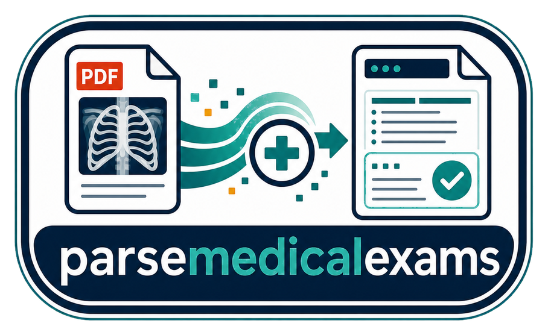
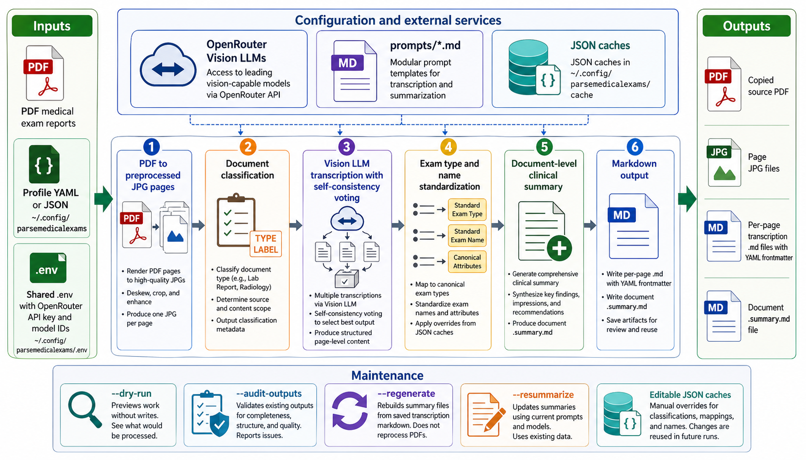

<div align="center">
  

  # parsemedicalexams

  **🏥 Extract and summarize medical exam reports from PDFs using Vision AI 📄**
</div>

parsemedicalexams is a Python CLI for turning PDF medical exam reports into structured markdown. It converts PDF pages to images, uses Vision LLMs through OpenRouter to transcribe and classify exams, then writes per-page markdown plus a document-level clinical summary.

It is built for personal medical record workflows where scanned reports, radiology results, ultrasounds, endoscopies, and similar documents need to become searchable files with YAML frontmatter.

## Install

```bash
git clone https://github.com/tsilva/parsemedicalexams.git
cd parsemedicalexams
uv tool install . --editable
```

Install Poppler before processing PDFs:

```bash
brew install poppler          # macOS
apt-get install poppler-utils # Ubuntu/Debian
```

## Configure

Runtime config lives outside the repo in `~/.config/parsemedicalexams`.

```bash
mkdir -p ~/.config/parsemedicalexams
cp .env.example ~/.config/parsemedicalexams/.env
cp profiles/template.yaml.example ~/.config/parsemedicalexams/myprofile.yaml
```

Edit `~/.config/parsemedicalexams/.env` with your OpenRouter key and model IDs:

```dotenv
OPENROUTER_API_KEY=your_api_key
EXTRACT_MODEL_ID=google/gemini-2.5-flash
SUMMARIZE_MODEL_ID=google/gemini-2.5-flash
SELF_CONSISTENCY_MODEL_ID=google/gemini-2.5-flash
VALIDATION_MODEL_ID=anthropic/claude-haiku-4.5
```

Edit `~/.config/parsemedicalexams/myprofile.yaml` with your input and output folders:

```yaml
name: "myprofile"
input_path: "/path/to/your/exam/pdfs"
output_path: "/path/to/your/output"
input_file_regex: ".*\\.pdf"
max_workers: 4
full_name: "Patient Name"
birth_date: "1980-01-31"
locale: "pt-PT"
```

Run the parser:

```bash
medicalexamsparser --profile myprofile
```

## Commands

```bash
medicalexamsparser --list-profiles              # list profiles in ~/.config/parsemedicalexams
medicalexamsparser --profile myprofile          # process new or incomplete PDFs
medicalexamsparser -p myprofile -d exam.pdf     # reprocess one document by filename or stem
medicalexamsparser -p myprofile --reprocess-all # force all matching PDFs to reprocess
medicalexamsparser -p myprofile --regenerate    # rebuild summaries from saved page markdown
medicalexamsparser -p myprofile --resummarize   # update summaries using current prompts/models
medicalexamsparser -p myprofile --audit-outputs # validate existing output bundles
medicalexamsparser -p myprofile --dry-run       # preview work without LLM calls or writes
python3 -m pytest                               # run tests
```

The package also installs `parsemedicalexams` as an alias for the same CLI.

## Output

Each processed PDF gets its own output folder:

```text
output/
└── {document}/
    ├── {document}.pdf
    ├── {document}.001.jpg
    ├── {document}.001.md
    ├── {document}.002.jpg
    ├── {document}.002.md
    └── {document}.summary.md
```

Page markdown files contain YAML frontmatter for fields such as `exam_date`, `title`, `category`, `exam_name_raw`, `doctor`, `facility`, `confidence`, `page`, and `source`, followed by the verbatim transcription.

## Notes

- Requires Python 3.9+, Poppler, and an OpenRouter API key.
- PDF page images and extracted text are sent to the configured OpenRouter-compatible API.
- Prompts are stored in `prompts/*.md`; model defaults and API settings are stored in the shared `.env`.
- Standardization caches live in `~/.config/parsemedicalexams/cache/*.json` and can be edited to override future mappings.
- Profiles can be YAML or JSON and can override model IDs, worker count, input regex, and patient context.

## Architecture



## License

[MIT](LICENSE)
